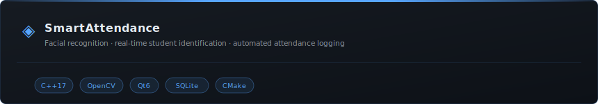
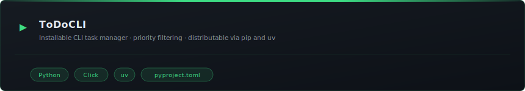
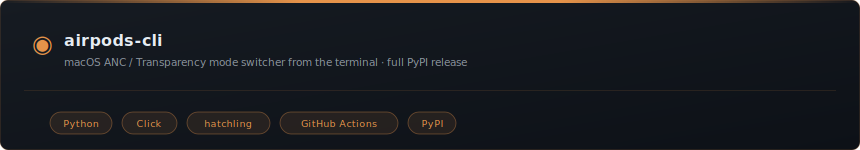
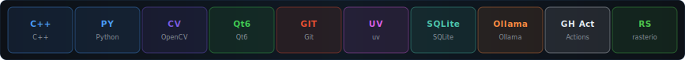
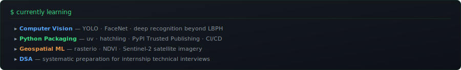

  

 

&nbsp;

&nbsp;

 

CE student at **Kathmandu University**. I write code that ships — a facial recognition attendance system in C++, a macOS CLI utility in Python, geospatial pipelines for satellite imagery. I care more about finishing than about stack.

Actively looking for a paid internship.

 

  

 

## Projects

&nbsp;&nbsp;

  

 

  

 

## Tech Stack

  

 

  

 

## GitHub Stats

&nbsp;&nbsp;

  

 

  

 

## What I'm Learning

  

 

  

 

## Certifications

| | Certificate | Issuer | Year | Verify |
|:---:|:---|:---|:---:|:---:|
| ★ | **AI Skills Fest 2026** | Microsoft | 2026 |  |
| ★ | **CS50P** — Introduction to Programming with Python | Harvard / edX | 2024 |  |
| ★ | **Python Essentials 2** | Cisco Networking Academy | 2023 |  |
| ★ | **Introduction to Data Science** | Cisco Networking Academy | 2024 |  |

 

  

